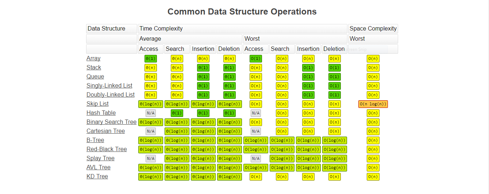
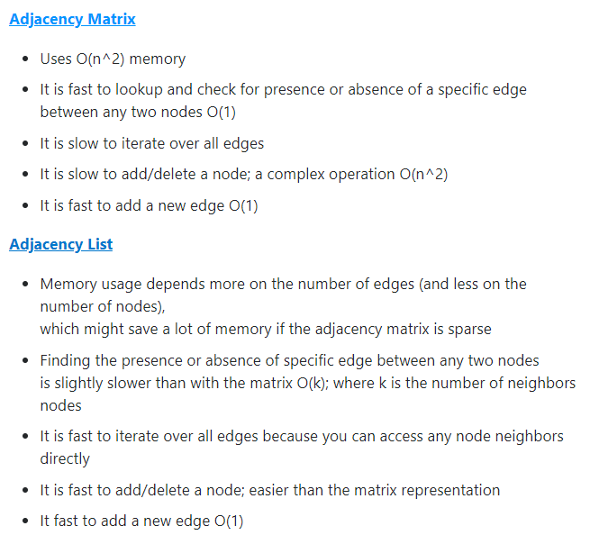
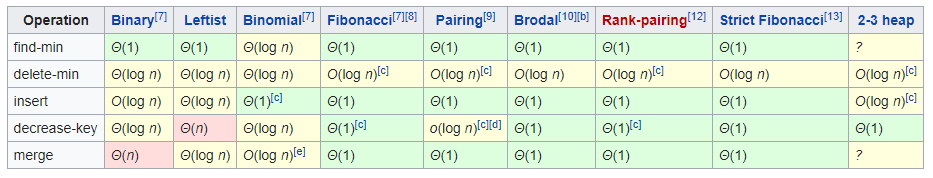

# SIP_Prep_C-plusplus

SIP Prep for DSA. May include DBMS later on.

## POINTERS

## DYNAMIC ALLOCATION (STACK AND HEAP MEMORY)

## RECURSION (PROBLEMS INCLUDED)

## ARRAYS

## LINKED LISTS (RECURSIVE + NON-RECURSIVE)

## DOUBLY LINKED LISTS

## QUEUES (ARRAY + LL IMPLEMENTATION)

## STACKS (ARRAY + LL IMPLEMENTATION)

## TREES (NORMAL + BINARY + BINARY SEARCH TREES)

Backlog = Red-Black Trees + AVL Trees

## GRAPHS
